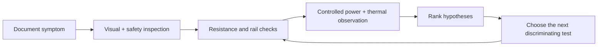

# Hardware Repair Lab

These are my board-level electronics diagnostic notes. Each case records the symptom, measurements, current hypotheses, and the next test. Some investigations are unfinished; their status stays unfinished here too.

## Case studies

| Device | Focus | Status |
|---|---|---|
| [Universal Audio Apollo Twin X](case-studies/apollo-twin-x/) | Power-rail isolation and thermal inspection | Fault area narrowed; repair unresolved |

## Diagnostic method

I keep observations separate from guesses, preserve the photos and measurements, and stop short of naming a failed component when the evidence does not support it.

## Safety and scope

The work shown here was performed on personally owned hardware. The repository contains no proprietary service documentation, customer data, firmware dumps, or bypass instructions. Measurements on powered electronics require appropriate current limiting, ESD precautions, and awareness of stored energy.
