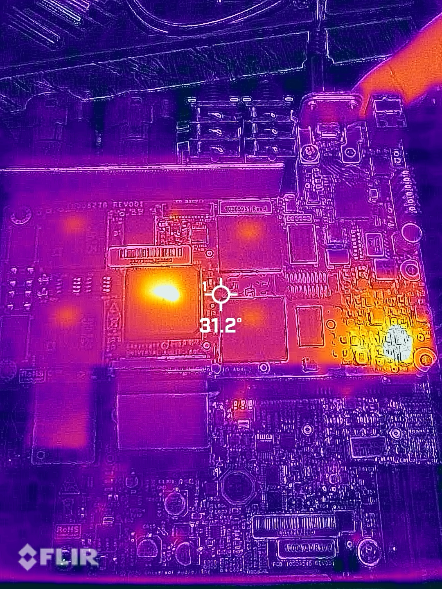
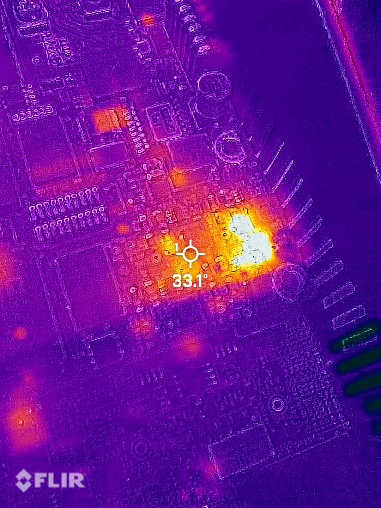
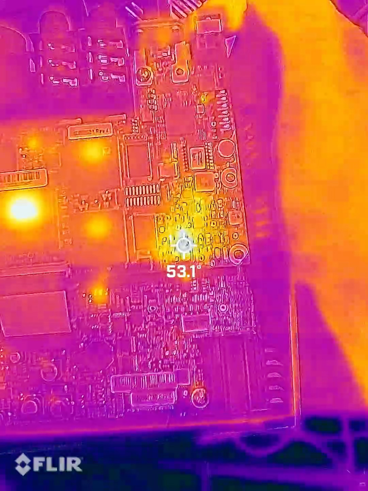

# Apollo Twin X power-rail investigation

**Status:** diagnosis in progress; no completed repair is claimed.

I opened this Apollo Twin X to investigate a power-related fault. Early resistance checks found an unexpectedly low reading between the 3.3 V rail and ground. The next job is to isolate the load without assuming that the warmest component is necessarily the failed one.

## Investigation sequence

1. Photograph the assembly before disturbing connectors or thermal interfaces.
2. Inspect both board faces for contamination, damaged passives, cracked packages, or prior rework.
3. Use a multimeter to compare the suspect 3.3 V rail with ground and adjacent rails.
4. Apply controlled power only within a safe diagnostic setup and watch current behavior.
5. Use thermal imaging to identify where injected or operating power is dissipated.
6. Treat heat as a localization clue, then separate a rail source, load, and downstream short with additional measurements.

## Evidence collected

| Evidence | Observation | Interpretation limit |
|---|---|---|
| Visual inspection | No single visually obvious failure explained the symptom | Absence of visible damage does not clear a component |
| Resistance checks | The 3.3 V rail showed unexpectedly low resistance to ground | A low reading can be a failed load, regulator path, or normal parallel loading |
| Thermal passes | Temperature distribution changed between baseline and powered observations; a localized hotspot became visible | A warm component may be dissipating current caused by a downstream fault |

| Logic-board access | Rail inspection |
|---|---|
|  |  |

## Thermal observations

The three frames below preserve the diagnostic progression. The displayed camera temperatures are observations from the instrument, not calibrated junction-temperature measurements.

| Baseline | Second pass | Localized hotspot |
|---|---|---|
|  |  |  |

## Working hypotheses

- A failed load is pulling down the 3.3 V rail.
- A regulator or protection component is providing the low-resistance path.
- Several normal loads in parallel make the unpowered resistance look suspicious, requiring comparison measurements before component removal.

## Next discriminating tests

- Identify the 3.3 V rail source and downstream branches from board continuity.
- Compare diode-mode and resistance readings in both probe polarities.
- Isolate branches or removable loads before desoldering active devices.
- If controlled injection is appropriate, begin below the nominal rail voltage with a strict current limit and monitor both current and temperature.

For now, the result is a smaller search area and a concrete test plan. I have not yet isolated the failed component.
